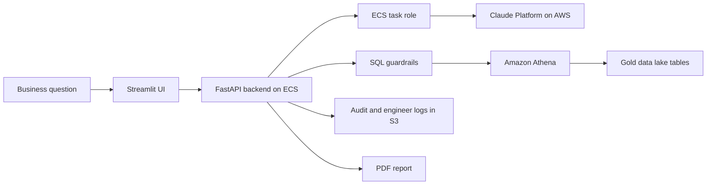

# Claude Platform on AWS for the Analytics Agent

## Why this change matters

I built the Analytics Agent so business questions can become safe Structured Query Language (SQL), run against Gold data in Amazon Athena, and return a plain-English answer with a chart, table, verdict check, audit log, and Portable Document Format (PDF) report.

Today, the agent can call Claude by using an Anthropic application programming interface (API) key. That works, but it means the running service depends on a long-lived secret. The better option now is Claude Platform on Amazon Web Services (AWS), because the agent can call Claude with its AWS Identity and Access Management (IAM) task role instead of a static API key.

That matters for three reasons:

1. The service identity is clearer. The caller is the Elastic Container Service (ECS) task role for the Analytics Agent.
2. Access control is cleaner. IAM can allow only the Claude actions the agent needs.
3. Billing and audit fit the rest of the platform. Claude usage can be charged through AWS, and calls can be visible through AWS audit services such as AWS CloudTrail.

This is not a full redesign of the Analytics Agent. The current agent flow is still the right design:

```text
Question
  -> Claude writes SQL
  -> Agent validates the SQL guardrails
  -> Athena runs the query on Gold data
  -> Claude explains the result
  -> Claude checks whether the answer matched the question
  -> Agent returns chart, table, verdict, audit log, and PDF report
```

The change is mainly how the agent authenticates to Claude.

## Authentication versus permission

Authentication means proving who is calling.

Permission means deciding what that caller can do.

For the Analytics Agent, Claude Platform on AWS should work like this:

```text
Authentication:
I am the ECS task role for the Analytics Agent.

Permission:
This role may call Claude inference for the Analytics Agent workspace, and nothing more.
```

This is the same idea already used across the platform. Athena does not get broad access to every bucket. It gets the specific permissions it needs to read query inputs and write query outputs. The Analytics Agent should not get broad Claude administration access. It should get only the minimum actions needed to ask Claude for model output and count tokens.

## Proposed target configuration

The proposed target is:

```text
Claude provider: Claude Platform on AWS
AWS Region: eu-central-1
Workspace: one workspace per environment
Authentication: IAM role attached to the ECS task
Billing: AWS billing
Audit: AWS CloudTrail where enabled
Model: Claude Sonnet, unless a later benchmark proves another model is better
```

Recommended workspace names:

```text
edp-dev-analytics-agent
edp-staging-analytics-agent
edp-prod-analytics-agent
```

The exact workspace identifiers are created by Claude Platform on AWS. Documentation and Terraform should use placeholders, not real account identifiers or secret-looking values.

## What changes in the application

The application should support two Claude provider modes during migration:

```text
anthropic_api_key
aws_claude_platform
```

In the AWS mode, the app should use:

```text
CLAUDE_PROVIDER=aws_claude_platform
AWS_REGION=eu-central-1
ANTHROPIC_BASE_URL=https://aws-external-anthropic.eu-central-1.api.aws
ANTHROPIC_WORKSPACE_ID=<workspace-id>
```

The app should stop requiring `ANTHROPIC_API_KEY` when `CLAUDE_PROVIDER=aws_claude_platform`.

## What changes in Terraform later

The code change should be made in two places:

1. `terraform-platform-infra-live/modules/iam-metadata/`
2. The Terraform module that defines the Analytics Agent ECS task environment variables and secrets

The IAM module should grant the Analytics Agent ECS task role only the Claude actions it needs. In plain English:

```text
The Analytics Agent ECS task role can create Claude inference requests and count tokens for the Analytics Agent Claude workspace.
It cannot manage Claude workspaces.
It cannot manage Claude users.
It cannot create Claude API keys.
It cannot manage Claude agents, tools, vaults, or memory stores.
```

The policy shape should be similar to this, with placeholders kept out of committed secrets:

```json
{
  "Effect": "Allow",
  "Action": [
    "aws-external-anthropic:CreateInference",
    "aws-external-anthropic:CountTokens"
  ],
  "Resource": "arn:aws:aws-external-anthropic:eu-central-1:<account-id>:workspace/<workspace-id>"
}
```

## Why this is the best current option

Claude Platform on AWS is the best current option for this project because it keeps the native Claude API path while moving identity, permissions, audit, and billing into AWS.

Amazon Bedrock is also a valid AWS-native way to use Claude, but it uses a different API surface. The current Analytics Agent is already built around Claude-style request and response behavior. Claude Platform on AWS should therefore be a smaller and cleaner migration than redesigning the agent around Bedrock.

The result is a more enterprise-style setup without throwing away the work already completed in the agent:



## Decision

I should adopt Claude Platform on AWS as a Phase 16 hardening task for the Analytics Agent.

The first implementation should be small:

1. Add the least-privilege IAM permission to the Analytics Agent ECS task role.
2. Add provider configuration so the app can use AWS IAM authentication.
3. Keep the current Claude API key path temporarily as a rollback option.
4. Test the same three Claude calls already used by the agent: SQL generation, insight writing, and verdict checking.
5. Remove the API-key path after the AWS path is stable.
