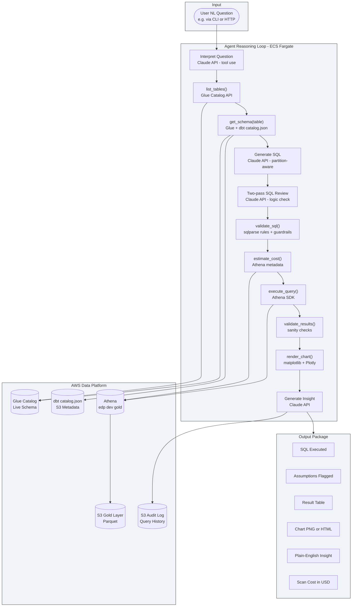

# platform-analytics-agent

This is the Natural Language (NL) Analytics Agent for the Enterprise Data Platform. It's the final layer of the platform: everything before this (DMS (Database Migration Service), Glue, dbt, MWAA (Amazon Managed Workflows for Apache Airflow)) exists to produce a clean, curated Gold data layer. This agent makes that data accessible to anyone who can ask a question in plain English, without needing to know SQL, table names, or partition structures.

---

## What problem this solves

The Gold layer holds carefully curated, business-ready aggregations. Getting value from it still requires an analyst who can write Athena SQL, knows the exact table and column names, and understands the partition structure well enough not to run expensive full-table scans. Most people at a company can't do all three. This agent removes that barrier.

A user asks: "Show me monthly transaction volume for Berlin over the last 12 months."

The agent:
1. Identifies the correct Gold table from the dbt (data build tool) schema catalog
2. Reads the partition keys from the Glue Data Catalog (Glue Catalog)
3. Generates an Athena SQL query with a partition filter to minimise scan cost
4. Checks the estimated bytes scanned before executing
5. Runs the query and validates the result for obvious anomalies
6. Produces a time-series chart
7. Returns a plain-English insight alongside the SQL it ran and every assumption it made

If it interpreted "transactions" as completed orders only, it says so explicitly before returning the result, so the user can catch that interpretation and correct it.

---

## Why Athena specifically

Amazon Athena is a serverless SQL (Structured Query Language) query engine that runs directly over S3 (Simple Storage Service) data. The cost model is pay-per-byte-scanned, not per compute hour. A query that scans the whole table because a partition filter is missing doesn't just run slowly — it costs real money and could easily hit the WorkGroup scan limit.

This is different from Databricks, BigQuery (Google's managed data warehouse), or Snowflake, which are managed warehouses with internal storage. Those platforms already have built-in NL (Natural Language) query features. Athena doesn't. Nobody ships an NL-to-SQL product that reasons about S3 partition structures and Glue Catalog metadata for cost optimisation. That's what this agent does.

The schema context is also richer here than in most text-to-SQL systems. The agent reads from two sources simultaneously:

- **Glue Catalog (live):** column names, data types, partition keys. Always current.
- **dbt catalog.json (from S3):** column descriptions, model documentation, accepted values, lineage. Written after every successful pipeline run by the MWAA DAG's `upload_dbt_artifacts` task.

Most NL-to-SQL tools only see column names. This agent sees the business meaning behind every column.

---

## Architecture



---

## How the reasoning loop works

The agent uses the Claude API with tool use (function calling). It doesn't generate SQL in one shot. It works through a structured loop where each step has a specific job and can fail safely.

### Step 1: Interpret the question

Claude reads the question and decides which tool to call first. For most questions, it starts with `list_tables()` to see what Gold tables exist, then calls `get_schema()` on the most likely candidate.

### Step 2: Resolve schema

`get_schema()` merges two live sources:
- `glue_client.get_table()`: current physical schema (column names, types, partition keys)
- `s3_client.get_object(Key="metadata/dbt/catalog.json")`: current business context (column descriptions, model documentation, accepted values)

The result gives Claude a complete picture: not just `order_id VARCHAR` but `order_id: unique identifier for each placed order, relates to fact_order_items`.

### Step 3: Generate and review SQL

Claude generates a SELECT query. It knows the partition keys from the schema and includes a partition filter. A second Claude call then reviews the SQL specifically for logical errors: wrong aggregation, missing join condition, filter that eliminates too much data.

### Step 4: Validate and cost-check

`validate_sql()` uses sqlparse to parse the query and enforce hard rules (SELECT only, Gold DB only, LIMIT present, no DDL). `estimate_cost()` uses Athena metadata to estimate bytes scanned and rejects the query if it exceeds the session threshold. The Athena WorkGroup `bytes_scanned_cutoff_per_query` setting in the Terraform processing module is the hard backstop.

### Step 5: Execute and validate results

`execute_query()` runs the query on Athena, polls for completion, and reads the result CSV from the S3 (Simple Storage Service) athena-results bucket. `validate_results()` checks: row count (0 rows is suspicious for a plausible question), null rates on key columns, numeric values within plausible bounds, and date range coverage matching what was asked.

### Step 6: Chart and insight

`render_chart()` selects a chart type based on the data shape, not just the question. Time-series data gets a line chart. Category vs metric with 8 or fewer categories gets a bar chart. More than 8 categories gets a horizontal bar chart sorted by value. The chart cardinality is checked before type selection to avoid unreadable outputs.

`summarise()` produces a 2-3 sentence plain-English insight. It includes every assumption made (for example, "'transactions' interpreted as completed orders only (status = 'completed')").

### Step 7: Audit

A structured JSON record is written to `s3://{bronze_bucket}/metadata/agent-audit/` containing the original question, interpretation, SQL, assumptions, row count, bytes scanned, cost in USD, validation flags, and summary. This audit log is itself queryable via Athena.

---

## Guardrails

These are non-negotiable and enforced before any query reaches Athena.

| Guardrail | How it's enforced |
|---|---|
| SELECT only | sqlparse rejects anything that isn't a single SELECT statement |
| Gold DB only | Target database validated against `edp_{env}_gold` whitelist |
| LIMIT required | Injected if the model omits it, default 1000 rows |
| No DDL in any form | `DROP`, `DELETE`, `INSERT`, `UPDATE`, `CREATE`, `ALTER`, `TRUNCATE` rejected in statement or subquery |
| Partition filter required | Queries against large tables must include at least one partition key filter |
| Retry safety | Retry only on transient errors (throttling, timeout). Never on semantic failures (table not found, permission denied) |
| Cost hard stop | Athena WorkGroup `bytes_scanned_cutoff_per_query` in Terraform processing module |
| Read-only IAM | The agent's ECS task role has zero write permissions on Bronze, Silver, or Gold data |

---

## Schema auto-sync with MWAA

The MWAA DAG includes a final task `upload_dbt_artifacts` that runs after every successful `dbt test`. It copies `target/manifest.json` and `target/catalog.json` from the dbt workspace to `s3://{bronze_bucket}/metadata/dbt/`.

The agent reads this path at query time, never from a local cache. When a dbt model is renamed, a column description is updated, or a new Gold table is added, the agent sees the change automatically at the next query after the next pipeline run. Schema drift from dbt refactors is impossible because the agent never holds a stale copy.

---

## Deployment

The agent runs as an ECS (Elastic Container Service) Fargate task. It can be invoked two ways:

**CLI invocation** (for direct testing):
```bash
aws ecs run-task \
  --cluster edp-dev-cluster \
  --task-definition edp-dev-analytics-agent \
  --overrides '{"containerOverrides":[{"name":"agent","environment":[{"name":"QUESTION","value":"Show monthly revenue by country for Q1 2025"}]}]}' \
  --profile dev-admin
```

**HTTP invocation** (via FastAPI behind an ALB (Application Load Balancer)):
```bash
curl -X POST https://{alb-dns}/query \
  -H "Content-Type: application/json" \
  -d '{"question": "Show monthly revenue by country for Q1 2025"}'
```

The response includes the SQL, assumptions, result table, chart presigned URL, insight, and scan cost.

### IAM role permissions

The ECS task role is scoped to exactly what the agent needs. Nothing more.

```
Athena:
  - athena:StartQueryExecution
  - athena:GetQueryExecution
  - athena:GetQueryResults
  - athena:StopQueryExecution

S3 (read):
  - s3:GetObject on {bronze_bucket}/metadata/dbt/*
  - s3:GetObject on {gold_bucket}/*
  - s3:GetObject, s3:PutObject on {athena_results_bucket}/*

S3 (write — agent outputs only):
  - s3:PutObject on {bronze_bucket}/metadata/agent-audit/*

Glue:
  - glue:GetTable
  - glue:GetDatabase
  - glue:GetPartitions
  on edp_{env}_gold database only

SSM:
  - ssm:GetParameter on /edp/{env}/anthropic_api_key
```

---

## Build phases

Each phase has a clear deliverable. No phase starts until the previous one passes `make lint`, `make typecheck`, and `make test`.

### Phase 1: Foundation

Project skeleton with CI from the first commit. No business logic yet.

- `pyproject.toml`, `.python-version`, `requirements.txt`, `requirements-dev.txt`
- `Makefile` — setup, lint, typecheck, test, run targets
- `Dockerfile` (two-stage build, non-root user) + `docker-compose.yml`
- `.env.example`, `.gitignore`
- `agent/exceptions.py` — named exception hierarchy (`AgentError`, `SchemaResolutionError`, `SQLValidationError`, `CostLimitError`, `ExecutionError`, `ResultValidationError`)
- `agent/config.py` — frozen dataclasses driven by environment variables, fail fast at startup if any required variable is missing
- `agent/logging.py` — structured JSON logger used by every module from day one
- `.github/workflows/ci.yml` — ruff + mypy + pytest on every push
- `tests/conftest.py` — shared fixtures for mocked AWS clients and mocked Claude API responses

Deliverable: `make lint`, `make typecheck`, `make test` all pass. Docker image builds cleanly. CI is green.

### Phase 2: IAM and infra design

Written before any AWS code so the executor is coded to the permission boundary, not retrofitted after.

- `infra/main.tf` — ECS cluster, task definition, and task IAM role scoped exactly to what the agent needs: read-only on Gold S3 and Glue Catalog, read/write on Athena results bucket, read on `metadata/dbt/*` in Bronze bucket, write on `metadata/agent-audit/*` in Bronze bucket, read on SSM parameter for the Anthropic API key

Deliverable: `terraform plan` produces the correct IAM role with no wildcard resource permissions.

### Phase 3: Schema resolver

The agent can't generate SQL without knowing what tables and columns exist.

- `agent/schema.py` — `SchemaResolver` class:
  - `list_gold_tables()` — calls `glue_client.get_tables()` for the Gold database, returns table names and descriptions
  - `get_schema(table_name)` — merges `glue_client.get_table()` (physical: column names, types, partition keys) with `catalog.json` read from `s3://{bronze_bucket}/metadata/dbt/` (business: column descriptions, accepted values, model docs). Returns a structured dict Claude can reason about.
  - Within-session cache so repeated calls on the same table don't hit Glue or S3 twice
  - Graceful fallback if `catalog.json` doesn't exist yet (pipeline hasn't run), falls back to Glue-only schema with a warning in the audit log
- `tests/test_schema.py` — parametrized tests with full mock fixtures for both Glue and S3 responses

Deliverable: `SchemaResolver` returns a correct merged schema dict for any Gold table. All edge cases tested.

### Phase 4: SQL validator

Guardrails are built before the SQL generator so no generated SQL can ever bypass them.

- `agent/validator.py` — `SQLValidator`:
  - Parses with sqlparse
  - Rejects anything that isn't a single SELECT statement
  - Rejects any DDL keyword anywhere in the statement or any subquery (`DROP`, `DELETE`, `INSERT`, `UPDATE`, `CREATE`, `ALTER`, `TRUNCATE`)
  - Rejects any database reference outside `edp_{env}_gold`
  - Injects `LIMIT 1000` if missing
  - Checks that at least one partition key filter is present for large tables
  - Returns validated SQL or raises `SQLValidationError` with a reason string Claude can act on
- `tests/test_validator.py` — parametrized, one test case per guardrail, both passing and failing inputs

Deliverable: `SQLValidator` enforces all guardrails. No SQL can reach Athena without passing through it.

### Phase 5: Prompts and Claude tool use loop

The agentic loop is a first-class module, not wired ad-hoc inside `main.py`.

- `agent/prompts.py` — all prompts in one place: system prompt, tool definitions, SQL review prompt, insight generation prompt. Prompts are reviewed and tuned independently of the rest of the code.
- `agent/claude_client.py` — `ClaudeClient` drives the tool use loop:
  - Sends question and tool definitions to the Claude API
  - Handles `tool_use` content blocks, dispatches to the correct tool function, sends `tool_result` back
  - Repeats until Claude returns a plain text response (end of reasoning)
  - Retries on transient errors (throttling, timeout) with exponential backoff
  - Hard fails immediately on semantic errors (table not found, permission denied) with no retry
- `tests/test_claude_client.py` — mocked Anthropic SDK responses covering single-turn, multi-turn tool use, and retry scenarios

Deliverable: `ClaudeClient` drives a full multi-turn tool use loop correctly. Retry behaviour tested.

### Phase 6: SQL generator with feedback loop

- `agent/generator.py` — `SQLGenerator`:
  - Calls `ClaudeClient` with the question and merged schema, gets a SELECT query and a list of assumptions
  - Runs the result through `SQLValidator`
  - If validation fails, sends the error back to Claude and asks for a corrected query. Up to 3 attempts before raising `SQLValidationError` to the user.
  - Runs a second Claude call (two-pass review) that checks the SQL specifically for logical errors: wrong aggregation, missing join condition, filter that eliminates all data
  - Returns reviewed SQL and flagged assumptions
- `tests/test_generator.py` — mocked `ClaudeClient`, tests the retry feedback loop, tests assumption extraction

Deliverable: `SQLGenerator` handles validation failures gracefully and recovers automatically.

### Phase 7: Cost estimator (partition-aware)

Athena has no dry-run mode. Cost is estimated by reading partition metadata from Glue.

- `agent/cost.py` — `CostEstimator`:
  - Parses partition key filters from the SQL using sqlparse
  - Calls `glue_client.get_partitions()` to find the matching S3 prefixes
  - Sums S3 object sizes for those prefixes to estimate bytes scanned
  - Raises `CostLimitError` if the estimate exceeds the session threshold from config
  - Also tracks actual bytes scanned post-execution for the audit log
- `tests/test_cost.py` — mocked Glue partition and S3 object responses, threshold enforcement tested

Deliverable: Cost estimation works against real partition metadata. Queries over threshold are blocked before execution.

### Phase 8: Athena executor

- `agent/executor.py` — `AthenaExecutor`:
  - `execute(sql)` — starts the Athena query, polls until complete, reads the result CSV from the S3 athena-results bucket
  - Returns a pandas DataFrame, actual bytes scanned, and actual cost in USD
  - Retries on transient Athena errors (throttling, internal service error), fails immediately on query errors (syntax, permission)
- `tests/test_executor.py` — mocked Athena start/poll/result cycle, failure handling tested

Deliverable: Full Athena execution path works correctly with proper error handling.

### Phase 9: Result validator, insight generator, and audit log

- `agent/result_validator.py` — `ResultValidator`: checks row count (zero rows on a plausible question is suspicious), null rates on key columns, numeric values within plausible bounds (negative revenue is flagged). Returns a list of flags — never blocks execution, always surfaces flags in output.
- `agent/insight.py` — `InsightGenerator`: final Claude call that takes the original question, SQL, result DataFrame, and assumptions, and returns a 2-3 sentence plain-English insight. Uses the insight prompt from `prompts.py`. Structured output so malformed responses raise `AgentError`, not crash.
- `agent/audit.py` — `AuditLogger`: writes a structured JSON record to `s3://{bronze_bucket}/metadata/agent-audit/` after every query. Fields: question, interpretation, SQL, assumptions, row count, bytes scanned, cost in USD, validation flags, insight, timestamp. The audit log is itself queryable via Athena.
- `tests/test_result_validator.py`, `tests/test_insight.py`

### Phase 10: CLI entry point and end-to-end integration

Wire all modules into the full loop.

- `agent/main.py` — orchestrates the complete reasoning chain. Handles errors at each stage with clear user-facing messages. CLI entry point: `python -m agent.main "question"`.
- `tests/test_integration.py` — marked `@pytest.mark.integration`, runs against the real AWS dev environment, not mocks. Run manually before deploy, not in CI.

Deliverable: `python -m agent.main "Show total orders by country"` returns SQL, result table, flagged assumptions, and a 2-sentence insight against live Athena data. This is the core agent complete.

### Phase 11: Charts

- `agent/charts.py` — `ChartGenerator`:
  - Detects data shape from the DataFrame: time-series, category vs metric, or distribution
  - Time-series → line chart (matplotlib static PNG)
  - 8 or fewer categories → vertical bar chart
  - More than 8 categories → horizontal bar chart sorted by value
  - Uploads PNG to `s3://{bronze_bucket}/metadata/agent-charts/`, returns presigned URL
  - Plotly interactive HTML version for the HTTP endpoint

### Phase 12: FastAPI HTTP endpoint and session state

- FastAPI route added to `agent/main.py` — POST `/query` accepts `{"question": "...", "session_id": "..."}`, returns full JSON response: SQL, assumptions, result table, presigned chart URL, insight, scan cost
- Session state keyed by `session_id` maintains conversation history for multi-turn follow-ups ("now break it down by region")

### Phase 13: Deploy pipeline and ECS infra

- `.github/workflows/deploy.yml` — CI passes → Docker build → push to ECR (Elastic Container Registry) → update ECS task definition → smoke test against dev Athena
- `infra/` expanded with ALB (Application Load Balancer), ECR repository, and ECS service
- Demo script covering 6 showcase questions across all chart types

---

## Cost per session

Following the test-and-destroy pattern, all costs are per session (2-3 hours).

| Component | Per session cost |
|---|---|
| ECS Fargate (0.5 vCPU, 1 GB, 3 hours) | ~$0.08 |
| Athena queries (50 queries, 20 MB avg scan each) | ~$0.005 |
| Claude API — claude-sonnet-4-6 (50 queries, ~3K tokens each round trip) | ~$1.20 |
| S3 (audit logs, chart PNGs, dbt artifact reads) | ~$0.01 |
| ALB (3 hours, if HTTP endpoint used) | ~$0.05 |
| **Total per session** | **~$1.35** |

Claude API cost dominates. The two-pass SQL review doubles the Claude calls per query but keeps total cost under $2 for a full demo session. Athena cost is negligible for Gold tables in a dev environment.

---

## Example interaction

**Question:** "Show me monthly transaction volume for Berlin over the last 12 months"

**Agent output:**

```
Interpretation (please confirm before I proceed):
  Table:   gold.monthly_revenue_trend (via fct_orders)
  Filter:  city = 'Berlin', order_date between 2024-04-01 and 2025-03-31
  Metric:  COUNT(DISTINCT order_id) grouped by year_month
  Note:    'transactions' interpreted as placed orders with status = 'completed'

SQL executed:
  SELECT
    date_trunc('month', order_date) AS month,
    COUNT(DISTINCT order_id) AS transaction_volume
  FROM edp_dev_gold.fct_orders
  WHERE city = 'Berlin'
    AND order_date >= DATE '2024-04-01'
    AND order_date < DATE '2025-04-01'
    AND status = 'completed'
  GROUP BY 1
  ORDER BY 1
  LIMIT 1000

Result: 12 rows returned
Bytes scanned: 4.3 MB  |  Cost: $0.000022

Insight:
Berlin completed orders peaked in November 2024 at 1,847 transactions,
driven by seasonal demand. Volume has been broadly stable through Q1 2025
at around 1,400 to 1,500 monthly transactions, roughly 12% above the same
period in 2024.

Chart: [presigned S3 URL — time series line chart]
```

---

## Tech stack

| Tool | What it does |
|---|---|
| Python 3.11.8 | Agent runtime |
| Claude API (claude-sonnet-4-6) | Question interpretation, SQL generation, insight summarisation |
| boto3 | AWS SDK: Athena, Glue Catalog, S3, SSM |
| sqlparse | SQL parsing and validation |
| FastAPI | HTTP endpoint |
| matplotlib | Static chart PNG generation |
| Plotly | Interactive chart HTML generation |
| ECS Fargate | Serverless container runtime |
| Amazon Athena | Executes generated SQL against Gold S3 data |
| AWS Glue Data Catalog | Live physical schema: column names, types, partition keys |
| dbt catalog.json | Business schema context: descriptions, accepted values, documentation |
| pytest | Unit and integration testing |
| ruff | Python linting |
| mypy | Static type checking |
| Docker | Local development and CI builds |

---

## Repository structure

```
platform-analytics-agent/
├── agent/                      ← Python agent source code
│   ├── main.py                 ← CLI entry point and FastAPI app
│   ├── config.py               ← frozen dataclasses, env var validation, fail fast on missing vars
│   ├── exceptions.py           ← named exception hierarchy
│   ├── logging.py              ← structured JSON logger used by every module
│   ├── prompts.py              ← all Claude prompts in one place: system, SQL review, insight
│   ├── claude_client.py        ← Claude API tool use loop: send, dispatch tools, retry on throttle
│   ├── schema.py               ← schema resolver: Glue (physical) + dbt catalog.json (business context)
│   ├── validator.py            ← SQL validator: sqlparse guardrail rules, SELECT-only, Gold DB only
│   ├── generator.py            ← SQL generator: two-pass review, validation feedback loop (3 attempts)
│   ├── cost.py                 ← cost estimator: partition-aware S3 byte scan estimate from Glue
│   ├── executor.py             ← Athena SDK: execute, poll, read results from S3
│   ├── result_validator.py     ← result sanity checks: row count, nulls, numeric bounds
│   ├── insight.py              ← insight generator: final Claude call, structured output
│   ├── charts.py               ← matplotlib PNG and Plotly HTML chart generation
│   └── audit.py                ← structured JSON audit log writer to S3
├── infra/                      ← Terraform for ECS Fargate, ALB, ECR, IAM task role
│   ├── main.tf
│   ├── variables.tf
│   └── outputs.tf
├── tests/                      ← pytest unit and integration tests
│   ├── conftest.py             ← shared fixtures: mocked boto3 clients, mocked Claude responses
│   ├── test_config.py
│   ├── test_exceptions.py
│   ├── test_schema.py
│   ├── test_validator.py
│   ├── test_claude_client.py
│   ├── test_generator.py
│   ├── test_cost.py
│   ├── test_executor.py
│   ├── test_result_validator.py
│   ├── test_insight.py
│   └── test_integration.py     ← marked @pytest.mark.integration, runs against real AWS dev
├── .python-version             ← 3.11.8 (pyenv)
├── pyproject.toml              ← ruff, mypy, pytest config
├── requirements.txt            ← runtime dependencies
├── requirements-dev.txt        ← dev tools: ruff, mypy, pytest
├── Dockerfile                  ← two-stage build, non-root user
├── docker-compose.yml          ← local dev
├── Makefile                    ← setup, lint, typecheck, test, run
└── README.md                   ← this file
```

---

## Status

**In development.** The architecture and guardrail design are finalised. Implementation starts with Phase 1: the core reasoning loop (schema resolution, SQL generation, Athena execution, assumption flagging). Visualisation and the HTTP endpoint follow in Phase 3.

This is the last component of the platform. Everything else is complete and validated end-to-end in AWS.
