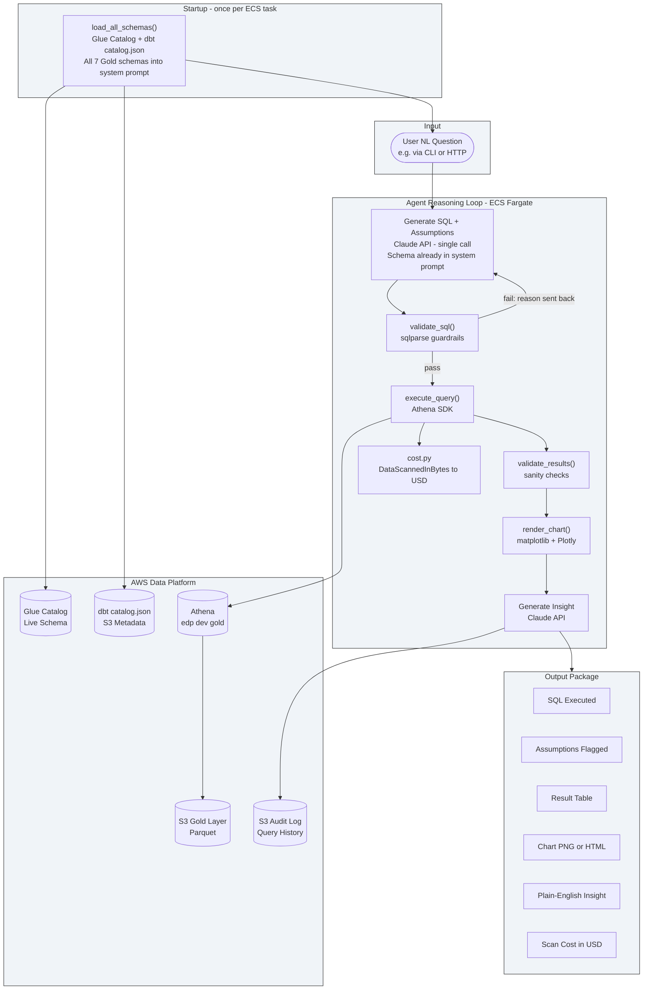

# platform-analytics-agent

This is the Natural Language (NL) Analytics Agent for the Enterprise Data Platform. It's the final layer of the platform: everything before this (DMS (Database Migration Service), Glue, dbt, MWAA (Amazon Managed Workflows for Apache Airflow)) exists to produce a clean, curated Gold data layer. This agent makes that data accessible to anyone who can ask a question in plain English, without needing to know SQL, table names, or partition structures.

---

## What problem this solves

The Gold layer holds carefully curated, business-ready aggregations. Getting value from it still requires an analyst who can write Athena SQL, knows the exact table and column names, and understands the partition structure well enough not to run expensive full-table scans. Most people at a company can't do all three. This agent removes that barrier.

A user asks: "Show me monthly transaction volume for Berlin over the last 12 months."

The agent:
1. Identifies the correct Gold table from the dbt (data build tool) schema catalog
2. Reads the partition keys from the Glue Data Catalog (Glue Catalog)
3. Generates an Athena SQL query with a partition filter to minimise scan cost
4. Checks the estimated bytes scanned before executing
5. Runs the query and validates the result for obvious anomalies
6. Produces a time-series chart
7. Returns a plain-English insight alongside the SQL it ran and every assumption it made

If it interpreted "transactions" as completed orders only, it says so explicitly before returning the result, so the user can catch that interpretation and correct it.

---

## Why Athena specifically

Amazon Athena is a serverless SQL (Structured Query Language) query engine that runs directly over S3 (Simple Storage Service) data. The cost model is pay-per-byte-scanned, not per compute hour. A query that scans the whole table because a partition filter is missing doesn't just run slowly — it costs real money and could easily hit the WorkGroup scan limit.

This is different from Databricks, BigQuery (Google's managed data warehouse), or Snowflake, which are managed warehouses with internal storage. Those platforms already have built-in NL (Natural Language) query features. Athena doesn't. Nobody ships an NL-to-SQL product that reasons about S3 partition structures and Glue Catalog metadata for cost optimisation. That's what this agent does.

The schema context is also richer here than in most text-to-SQL systems. The agent reads from two sources simultaneously:

- **Glue Catalog (live):** column names, data types, partition keys. Always current.
- **dbt catalog.json (from S3):** column descriptions, model documentation, accepted values, lineage. Written after every successful pipeline run by the MWAA DAG's `upload_dbt_artifacts` task.

Most NL-to-SQL tools only see column names. This agent sees the business meaning behind every column.

---

## Architecture



---

## How the reasoning loop works

The agent starts each ECS task by loading all Gold schemas once and embedding them in the Claude system prompt. Claude knows every table and column before it sees the first question. This eliminates the multi-turn `list_tables` / `get_schema` tool-call round trips that text-to-SQL systems typically need.

### Startup: eager schema loading

`SchemaResolver.load_all_schemas()` runs once at startup. It reads all Gold tables from Glue Catalog (column names, data types, partition keys) and overlays dbt catalog.json from S3 (column descriptions, model documentation) for every table. The result — all 7 Gold schemas, roughly 2,500 tokens — is embedded directly in the system prompt.

If catalog.json isn't present yet (the pipeline hasn't run), it falls back to Glue-only schema and logs a warning. No crash, no partial startup.

### Step 1: Generate SQL in a single Claude call

Claude reads the question against the schema already in the system prompt and returns a SELECT query plus a list of assumptions (for example, "'transactions' interpreted as completed orders only"). No tool calls needed in the common case.

### Step 2: Validate

`SQLValidator` parses the query with sqlparse and enforces hard rules: SELECT only, Gold database only, no DDL keywords anywhere, LIMIT present. If validation fails, the error reason is sent back to Claude with a correction request. Up to 3 attempts before raising `SQLValidationError` to the user. The Athena WorkGroup `bytes_scanned_cutoff_per_query` setting in Terraform is the hard cost backstop.

### Step 3: Execute and track cost

`AthenaExecutor` starts the query, polls until complete, and reads the result CSV from the athena-results S3 bucket. `cost.py` converts `DataScannedInBytes` from the Athena execution metadata to USD. No pre-execution cost estimation needed — Gold tables are small pre-aggregations, and the WorkGroup hard stop handles any outliers.

### Step 4: Validate results

`ResultValidator` checks the DataFrame for obvious anomalies: negative values in revenue columns, unexpected nulls on key columns. Zero rows is a valid result for Gold tables — an aggregation with no matching data is a legitimate answer, not a bug. Flags are surfaced in the output, never block execution.

### Step 5: Chart and insight

`ChartGenerator` selects chart type from data shape: time-series data gets a line chart, 8 or fewer categories get a bar chart, more than 8 get a horizontal bar chart sorted by value. The chart is uploaded to S3 and returned as a presigned URL (Uniform Resource Locator).

`InsightGenerator` makes a final Claude call with the original question, SQL, result sample, and assumptions, and returns a 2-3 sentence plain-English insight.

### Step 6: Audit

A structured JSON record is written to `s3://{bronze_bucket}/metadata/agent-audit/` containing the original question, SQL, assumptions, row count, bytes scanned, cost in USD, validation flags, and insight. The audit log is itself queryable via Athena.

---

## Guardrails

These are non-negotiable and enforced before any query reaches Athena.

| Guardrail | How it's enforced |
|---|---|
| SELECT only | sqlparse rejects anything that isn't a single SELECT statement |
| Gold DB only | Target database validated against `edp_{env}_gold` whitelist |
| LIMIT required | Injected if the model omits it, default 1000 rows |
| No DDL in any form | `DROP`, `DELETE`, `INSERT`, `UPDATE`, `CREATE`, `ALTER`, `TRUNCATE` rejected in statement or subquery |
| Partition filter required | Queries against large tables must include at least one partition key filter |
| Retry safety | Retry only on transient errors (throttling, timeout). Never on semantic failures (table not found, permission denied) |
| Cost hard stop | Athena WorkGroup `bytes_scanned_cutoff_per_query` in Terraform processing module |
| Read-only IAM | The agent's ECS task role has zero write permissions on Bronze, Silver, or Gold data |

---

## Schema auto-sync with MWAA

The MWAA DAG includes a final task `upload_dbt_artifacts` that runs after every successful `dbt test`. It copies `target/manifest.json` and `target/catalog.json` from the dbt workspace to `s3://{bronze_bucket}/metadata/dbt/`.

The agent reads this path at query time, never from a local cache. When a dbt model is renamed, a column description is updated, or a new Gold table is added, the agent sees the change automatically at the next query after the next pipeline run. Schema drift from dbt refactors is impossible because the agent never holds a stale copy.

---

## End-to-end testing

This section covers exactly how to test the agent against live AWS infrastructure and ask real questions against your Gold data.

There are two test tracks. Start with Track 1 (local). It's faster to iterate on, proves all the AWS integrations work, and produces the same output as ECS. Once that passes, Track 2 confirms the deployed container and ECS service work.

---

### Prerequisites (do these once before the first test)

**1. Store your Anthropic API key in SSM Parameter Store.**

The agent fetches its API key from AWS Systems Manager (SSM) at startup. It never reads it from a file or environment variable directly — this way the key never appears in ECS task logs or Terraform state.

Go to the AWS console, make sure you're in `eu-central-1`, and navigate to Systems Manager > Parameter Store. Create a new parameter with these exact values:

| Field | Value |
|---|---|
| Name | `/edp/dev/anthropic_api_key` |
| Type | `SecureString` |
| Value | Your Anthropic API key (starts with `sk-ant-`) |
| KMS key | Use the default `aws/ssm` key |

You only need to do this once. The parameter survives `terraform destroy` because it's not managed by Terraform.

Alternatively, do it from the terminal:

```bash
aws ssm put-parameter \
  --name "/edp/dev/anthropic_api_key" \
  --type "SecureString" \
  --value "sk-ant-YOUR-KEY-HERE" \
  --profile dev-admin \
  --region eu-central-1
```

To verify it was stored:

```bash
aws ssm get-parameter \
  --name "/edp/dev/anthropic_api_key" \
  --with-decryption \
  --profile dev-admin \
  --region eu-central-1
```

**2. Confirm the MWAA pipeline has run and Gold data exists.**

The agent queries the Gold Athena tables. If the pipeline hasn't run yet, every query will return zero rows (or a table-not-found error if the Glue Catalog is empty). Log into the Airflow UI for your MWAA environment (`edp-dev-mwaa`) and confirm `edp_pipeline` has at least one successful DAG run. If it hasn't, trigger it manually and wait for it to complete (about 6-8 minutes).

You can also confirm Gold data exists by running a quick Athena query in the AWS console:

```sql
SELECT COUNT(*) FROM "edp_dev_gold"."fct_orders" LIMIT 1;
```

If this returns a count greater than zero, the Gold layer is ready.

**3. Confirm the deploy workflow completed.**

When you pushed the latest code changes to `main`, GitHub Actions ran the CI workflow first (lint, type check, unit tests, Docker build). Once CI passed, the Deploy workflow triggered automatically and built the Docker image, pushed it to ECR (Elastic Container Registry), and updated the ECS task definition.

Go to the GitHub repository for `platform-analytics-agent`, click Actions, and confirm both the CI and Deploy workflows have a green tick for your latest push. If Deploy is still running, wait for it to finish before testing Track 2.

---

### Track 1: Local functional test (start here)

This runs the agent Python code directly on your Mac against the real AWS dev environment. It uses your local `dev-admin` AWS profile for credentials, connects to real Athena, real Glue Catalog, and real SSM. The output is identical to what you'd see in ECS — the only difference is that the compute runs on your Mac instead of Fargate.

**Step 1: Create your `.env` file.**

Copy `.env.example` to `.env`:

```bash
cd platform-analytics-agent
cp .env.example .env
```

Open `.env` and fill in the values. The only things you need to change are the bucket names and your AWS account ID. You can find your account ID by running:

```bash
aws sts get-caller-identity --profile dev-admin --query Account --output text
```

Update `.env` with your account ID substituted in:

```
AWS_REGION=eu-central-1
AWS_PROFILE=dev-admin
ENVIRONMENT=dev
BRONZE_BUCKET=edp-dev-YOUR_ACCOUNT_ID-bronze
GOLD_BUCKET=edp-dev-YOUR_ACCOUNT_ID-gold
ATHENA_RESULTS_BUCKET=edp-dev-YOUR_ACCOUNT_ID-athena-results
ATHENA_WORKGROUP=edp-dev-workgroup
GLUE_GOLD_DATABASE=edp_dev_gold
SSM_API_KEY_PARAM=/edp/dev/anthropic_api_key
COST_THRESHOLD_USD=0.10
MAX_ROWS=1000
```

**Step 2: Activate the virtual environment.**

```bash
source .venv/bin/activate
```

If you haven't run `make setup` yet:

```bash
make setup
source .venv/bin/activate
```

**Step 3: Load the `.env` file.**

The agent reads these values from environment variables, not from the `.env` file directly. Load them into your shell session:

```bash
export $(grep -v '^#' .env | xargs)
```

**Step 4: Ask your first question.**

```bash
python -m agent.main "Which country has the highest total revenue?"
```

The agent takes 12-20 seconds to respond. On the first run there's an additional few seconds for schema loading (Glue Catalog + dbt catalog.json from S3). What you'll see printed:

- The SQL it generated
- Every assumption it made ("'revenue' interpreted as the `total_price` column on completed orders")
- The result table
- Bytes scanned and cost in USD
- A 2-3 sentence plain-English insight
- A presigned S3 URL (Uniform Resource Locator) for the chart PNG

**Step 5: Try these test questions.**

Run each one with `python -m agent.main "question"`. They're ordered to cover different Gold tables, different chart types, and different kinds of reasoning.

```bash
# Bar chart — top categories, single aggregation
python -m agent.main "Show me total revenue by country"

# Line chart — time-series, tests date reasoning
python -m agent.main "What does monthly order volume look like over the last 12 months?"

# Filtering + aggregation — tests WHERE clause generation
python -m agent.main "Which product categories are most popular in Germany?"

# Multi-metric — tests selecting the right columns
python -m agent.main "Compare average order value across countries"

# Count + group by — tests COUNT vs SUM disambiguation
python -m agent.main "How many unique customers placed orders in each country?"

# Trend question — tests the agent's ability to reason about time
python -m agent.main "Is revenue growing or declining? Show me the trend."
```

**What to look for in each response:**

- The SQL should have a `WHERE` clause with a partition filter (e.g., `dt >= ...`) — this confirms partition-aware query generation is working
- The assumptions list should explain any interpretation decisions Claude made
- The insight should be specific to the actual numbers in the result, not generic
- The presigned URL should be a real S3 URL — open it in a browser to see the chart
- Bytes scanned should be small (under 10 MB for Gold tables) — confirms the partition filters are working
- Cost should be under $0.001 per query — confirms the Gold layer's efficiency

**Step 6: Test multi-turn follow-up.**

For multi-turn follow-up (where the agent remembers the previous question), you need the HTTP endpoint. That's covered in Track 2. The CLI mode (`python -m agent.main`) is single-turn only — each invocation is independent.

---

### Track 2: Test the deployed ECS service

Once Track 1 passes, this confirms the Docker image that was pushed to ECR works correctly when run as an ECS task, and that the ECS service behind the ALB (Application Load Balancer) is healthy.

**Step 1: Get the resource names from Terraform outputs.**

```bash
cd terraform-platform-infra-live/environments/dev
terraform output analytics_agent_cluster
terraform output analytics_agent_task_definition
terraform output analytics_agent_log_group
terraform output analytics_agent_alb_dns
```

Write down these values. You'll use them in the commands below.

**Step 2: Get the private subnet ID and security group ID.**

The ECS task runs in a private subnet inside the VPC. You need one private subnet ID and the agent security group ID for the `network-configuration` flag.

```bash
# List private subnets (look for subnets tagged Name=edp-dev-private-*)
aws ec2 describe-subnets \
  --filters "Name=tag:Name,Values=edp-dev-private-*" \
  --query "Subnets[*].[SubnetId,Tags[?Key=='Name'].Value|[0]]" \
  --output table \
  --profile dev-admin \
  --region eu-central-1

# Get the agent security group ID
aws ec2 describe-security-groups \
  --filters "Name=group-name,Values=edp-dev-analytics-agent-tasks" \
  --query "SecurityGroups[0].GroupId" \
  --output text \
  --profile dev-admin \
  --region eu-central-1
```

**Step 3: Run a one-off ECS task with a question.**

This launches the container, asks a single question, writes the result to CloudWatch Logs, and exits. Replace `SUBNET_ID` and `SG_ID` with the values from Step 2.

```bash
aws ecs run-task \
  --cluster edp-dev-analytics-agent \
  --task-definition edp-dev-analytics-agent \
  --launch-type FARGATE \
  --network-configuration 'awsvpcConfiguration={subnets=[SUBNET_ID],securityGroups=[SG_ID],assignPublicIp=DISABLED}' \
  --overrides '{"containerOverrides":[{"name":"agent","command":["Which country has the highest total revenue?"]}]}' \
  --profile dev-admin \
  --region eu-central-1
```

This command returns immediately with a `taskArn`. The container is now starting up in the background.

**Step 4: Watch the logs.**

The agent writes structured JSON logs to CloudWatch. Stream them live in your terminal:

```bash
aws logs tail /edp/dev/analytics-agent \
  --follow \
  --profile dev-admin \
  --region eu-central-1
```

You'll see log lines as the agent starts up (schema loading), generates SQL, executes the Athena query, and produces the insight. The final log lines will contain the insight text and the presigned chart URL.

Wait for the log stream to go quiet (about 15-20 seconds after startup). When you see a log line containing `"insight"`, the run is complete. Press Ctrl-C to stop tailing.

**Step 5: Check the ECS service is healthy.**

The ECS service runs one task continuously so the HTTP endpoint is always available. Confirm it's healthy:

```bash
aws ecs describe-services \
  --cluster edp-dev-analytics-agent \
  --services edp-dev-analytics-agent \
  --profile dev-admin \
  --region eu-central-1 \
  --query "services[0].{Status:status,Running:runningCount,Desired:desiredCount,Health:healthCheckGracePeriodSeconds}"
```

You want `runningCount` to equal `desiredCount` (both should be `1`) and `status` to be `ACTIVE`.

**Step 6: Test the HTTP endpoint (multi-turn questions).**

The ALB is internal — it's only reachable from inside the VPC. The simplest way to reach it is via an SSM (Systems Manager) port-forwarding session from your Mac.

First, you need an EC2 instance running inside the VPC to forward through. If the ingestion module's bastion host is deployed (`aws_instance.bastion` in `environments/dev/main.tf`), uncomment the bastion outputs in `environments/dev/outputs.tf`, run `terraform apply`, and note the bastion instance ID.

Then open an SSM port-forwarding tunnel. This command creates a tunnel from port 8080 on your Mac to port 80 on the internal ALB, through the bastion:

```bash
# Replace BASTION_INSTANCE_ID and ALB_DNS with values from terraform output
aws ssm start-session \
  --target BASTION_INSTANCE_ID \
  --document-name AWS-StartPortForwardingSessionToRemoteHost \
  --parameters "host=ALB_DNS,portNumber=80,localPortNumber=8080" \
  --profile dev-admin \
  --region eu-central-1
```

Leave this running in one terminal window. In a second terminal, you can now hit the agent as if it were running locally on your Mac:

**Ask a question:**

```bash
curl -s -X POST http://localhost:8080/ask \
  -H "Content-Type: application/json" \
  -d '{"question": "Which country has the highest total revenue?"}' | python3 -m json.tool
```

The response JSON includes `insight`, `assumptions`, `execution_id`, `bytes_scanned`, `cost_usd`, `session_id`, `chart_type`, and `presigned_url`.

**Ask a follow-up question (multi-turn):**

Copy the `session_id` from the first response and pass it in the next request. The agent will remember the previous question and can resolve references like "now break it down by city" without re-stating the original question.

```bash
# Replace SESSION_ID with the value from the first response
curl -s -X POST http://localhost:8080/ask \
  -H "Content-Type: application/json" \
  -d '{"question": "Now break that down by city", "session_id": "SESSION_ID"}' | python3 -m json.tool
```

**Check the health endpoint:**

```bash
curl http://localhost:8080/health
# Expected: {"status": "ok"}
```

---

### Suggested test questions for a full demo

These six questions cover every Gold table, every chart type, and several multi-turn follow-up patterns. Run them in sequence during a demo session.

| # | Question | What it tests |
|---|---|---|
| 1 | "Which country has the highest total revenue?" | Bar chart, top-N aggregation |
| 2 | "Show me monthly order volume as a trend over the last year" | Line chart, time-series, date reasoning |
| 3 | "What are the top 5 product categories by revenue in Germany?" | Filtered bar chart, WHERE clause with partition |
| 4 | "Compare average order value across all countries" | Horizontal bar chart (many categories) |
| 5 | "How many unique customers have placed orders in each country?" | COUNT DISTINCT, tests SUM vs COUNT disambiguation |
| 6 | "Is there a seasonal pattern in order volume?" | Line chart, tests pattern-recognition insight generation |

For multi-turn follow-up, after question 2 ask: "Which month had the lowest volume and why do you think that is?" — the agent will answer referencing the same SQL execution without re-running the query.

---

### What to do if something goes wrong

**"Missing required environment variables"** — You forgot to `export $(grep -v '^#' .env | xargs)` before running the command, or a variable name is misspelled in your `.env` file.

**"SchemaResolutionError: Glue Catalog unreachable"** — The infra isn't up, or your `dev-admin` profile doesn't have permission to call `glue:GetTables`. Confirm `terraform apply` completed successfully and the `edp_dev_gold` Glue database exists in the AWS console.

**"No tables found in Gold database"** — The MWAA pipeline hasn't run yet. Trigger `edp_pipeline` in the Airflow UI and wait for it to complete.

**"ParameterNotFound: /edp/dev/anthropic_api_key"** — You skipped the SSM prerequisite step. Run the `aws ssm put-parameter` command from the Prerequisites section.

**"AccessDenied on SSM GetParameter"** — The ECS task role doesn't have permission to read this SSM path. Confirm `terraform apply` ran successfully and the `analytics-agent` module is included.

**"Athena query failed: TABLE_NOT_FOUND"** — Either the Gold Glue Catalog tables don't exist (run the MWAA pipeline) or the GLUE_GOLD_DATABASE value in `.env` is wrong (should be `edp_dev_gold` with underscores, not hyphens).

**Deploy workflow triggered but ECS task keeps stopping** — Check CloudWatch Logs at `/edp/dev/analytics-agent` for the startup error. The most common cause is a missing SSM parameter or a container startup crash.

---

## Deployment

The agent runs as an ECS (Elastic Container Service) Fargate service. It starts automatically when the ECS service is created by Terraform. The `deploy.yml` GitHub Actions workflow builds and deploys a new image on every merge to `main`.

**ECS cluster:** `edp-dev-analytics-agent`
**ECS service:** `edp-dev-analytics-agent`
**ECR repository:** `edp-dev-analytics-agent`
**CloudWatch log group:** `/edp/dev/analytics-agent`

**HTTP endpoint (from within the VPC):**
```
POST http://{alb-dns-name}/ask
GET  http://{alb-dns-name}/health
```

**One-off CLI question (from your Mac via ECS run-task):**
```bash
aws ecs run-task \
  --cluster edp-dev-analytics-agent \
  --task-definition edp-dev-analytics-agent \
  --launch-type FARGATE \
  --network-configuration 'awsvpcConfiguration={subnets=[SUBNET_ID],securityGroups=[SG_ID],assignPublicIp=DISABLED}' \
  --overrides '{"containerOverrides":[{"name":"agent","command":["Which country has the highest revenue?"]}]}' \
  --profile dev-admin \
  --region eu-central-1
```

### IAM role permissions

The ECS task role is defined in `terraform-platform-infra-live/modules/analytics-agent/main.tf` and scoped to exactly what the agent needs. Nothing more.

```
Athena:
  - athena:StartQueryExecution
  - athena:GetQueryExecution
  - athena:GetQueryResults
  - athena:StopQueryExecution

S3 (read):
  - s3:GetObject on {bronze_bucket}/metadata/dbt/*
  - s3:GetObject on {gold_bucket}/*
  - s3:GetObject, s3:PutObject on {athena_results_bucket}/*

S3 (write — agent outputs only):
  - s3:PutObject on {bronze_bucket}/metadata/agent-audit/*
  - s3:PutObject on {gold_bucket}/charts/*

Glue:
  - glue:GetTable
  - glue:GetDatabase
  - glue:GetPartitions
  on edp_{env}_gold database only

SSM:
  - ssm:GetParameter on /edp/{env}/anthropic_api_key
```

---

## Build phases

Each phase has a clear deliverable. No phase starts until the previous one passes `make lint`, `make typecheck`, and `make test`.

### Phase 1: Foundation — complete

Project skeleton with CI from the first commit. No business logic yet.

- `pyproject.toml`, `.python-version`, `requirements.txt`, `requirements-dev.txt`
- `Makefile` — setup, lint, typecheck, test, run targets
- `Dockerfile` (two-stage build, non-root user) + `docker-compose.yml`
- `.env.example`, `.gitignore`
- `agent/exceptions.py` — named exception hierarchy (`AgentError`, `SchemaResolutionError`, `SQLValidationError`, `CostLimitError`, `ExecutionError`, `ResultValidationError`)
- `agent/config.py` — frozen dataclasses driven by environment variables, fail fast at startup if any required variable is missing
- `agent/logging.py` — structured JSON logger used by every module from day one
- `.github/workflows/ci.yml` — ruff + mypy + pytest on every push
- `tests/conftest.py` — shared fixtures for mocked AWS clients and mocked Claude API responses

Deliverable: `make lint`, `make typecheck`, `make test` all pass. Docker image builds cleanly. CI is green.

### Phase 2: IAM and infra design — complete

Written before any AWS code so the executor is coded to the permission boundary, not retrofitted after.

All AWS infrastructure lives in `terraform-platform-infra-live/modules/analytics-agent/` — the same repo and state file as the rest of the platform. This is intentional: the agent's IAM role references bucket names, KMS key ARN, and Glue database name that are outputs of sibling modules. Keeping everything in one state file means no manual `tfvars` to maintain, and the teardown workflow covers the agent automatically.

Resources: ECR repository (scan on push, lifecycle policy keeps last 10 images), ECS cluster (FARGATE, Container Insights enabled), CloudWatch log group (30-day retention, KMS-encrypted), task execution role (ECR pull + CloudWatch write only), task IAM role (scoped exactly), security group (egress port 443 only), ECS task definition (512 CPU / 1024 MB, `lifecycle.ignore_changes` so CI updates the image without Terraform re-deploying).

Task IAM role grants: Gold S3 read-only, Athena results bucket read/write, Bronze `metadata/dbt/*` read, Bronze `metadata/agent-audit/*` write, Glue Gold catalog read-only, Athena query execution on the platform workgroup only, SSM API key read on `/edp/{env}/anthropic_api_key`, KMS decrypt on platform key only. No wildcard resources anywhere.

Deliverable: `terraform plan` in `terraform-platform-infra-live/environments/dev` produces the correct IAM role. All application AWS code is written inside this permission boundary.

### Phase 3: Schema resolver — complete

The Gold layer has 7 small, pre-aggregated tables with 5-10 columns each. All schemas are loaded eagerly at startup and embedded in the system prompt — Claude knows every table and column before it sees the first question. This eliminates the `list_tables` / `get_schema` tool call round trips from the common case and is the single biggest latency saving in the design.

- `agent/schema.py` — `SchemaResolver` class:
  - `load_all_schemas()` — called once at startup. Reads `catalog.json` from `s3://{bronze_bucket}/metadata/dbt/` and fetches all Gold tables from `glue_client.get_tables()`. Merges physical schema (column names, types, partition keys) with business context (column descriptions, accepted values, model docs) for every table. Returns a single dict covering all 7 Gold tables (~2,500 tokens total). This dict is embedded directly in the system prompt so Claude starts every query with full schema awareness.
  - `get_schema(table_name)` — available as a tool for edge cases where Claude needs to re-examine one table during reasoning, but won't be called in normal operation.
  - Graceful fallback if `catalog.json` doesn't exist yet (pipeline hasn't run): falls back to Glue-only schema with a warning logged.
- `tests/test_schema.py` — parametrized tests with full mock fixtures for both Glue and S3 responses, including the fallback path.

Deliverable: `SchemaResolver.load_all_schemas()` returns the complete merged schema for all Gold tables in one call. Tested with and without `catalog.json` present.

### Phase 4: SQL validator — complete

Guardrails are built before the SQL generator so no generated SQL can ever bypass them.

- `agent/validator.py` — `SQLValidator`:
  - Parses with sqlparse
  - Rejects anything that isn't a single SELECT statement
  - Rejects any DDL keyword anywhere in the statement or any subquery (`DROP`, `DELETE`, `INSERT`, `UPDATE`, `CREATE`, `ALTER`, `TRUNCATE`)
  - Rejects any database reference outside `edp_{env}_gold`
  - Injects `LIMIT 1000` if missing
  - Checks that at least one partition key filter is present for large tables
  - Returns validated SQL or raises `SQLValidationError` with a reason string Claude can act on
- `tests/test_validator.py` — parametrized, one test case per guardrail, both passing and failing inputs

Deliverable: `SQLValidator` enforces all guardrails. No SQL can reach Athena without passing through it.

### Phase 5: Prompts and Claude client — complete

The agentic loop is a first-class module, not wired ad-hoc inside `main.py`.

- `agent/prompts.py` — all prompts in one place, reviewed and tuned independently of code:
  - System prompt: includes the full pre-loaded Gold schema dict from Phase 3, guardrail rules, and output format expectations. Because all schemas are embedded here, Claude can answer most questions in a single non-tool-call response.
  - SQL generation prompt: question + schema context → SELECT query + assumptions list
  - Insight prompt: question + SQL + result sample → 2-3 sentence plain-English insight
  - Tool definitions: `get_schema` (for edge cases where Claude needs to re-examine one table)
- `agent/claude_client.py` — `ClaudeClient`:
  - For the common case (question maps clearly to one Gold table): single Claude call, no tool use needed. Claude reads the schema from the system prompt and returns SQL + assumptions directly.
  - For edge cases (ambiguous question, needs to re-examine a specific table): handles `tool_use` content blocks, dispatches `get_schema`, sends `tool_result` back, repeats until text response.
  - Retries on transient errors (throttling, timeout) with exponential backoff.
  - Hard fails immediately on semantic errors (table not found, permission denied) with no retry.
- `tests/test_claude_client.py` — mocked Anthropic SDK responses covering single-turn (common case), tool-use fallback, and retry scenarios.

Deliverable: `ClaudeClient` handles both the single-call common path and the tool-use fallback path correctly. Retry behaviour tested.

### Phase 6: SQL generator with feedback loop — complete

Gold queries are simple: `SELECT` from one pre-aggregated table with optional `WHERE` filters. A second review pass designed for complex JOINs adds latency and tokens with no benefit here. Single-pass generation with validation feedback is the right design.

- `agent/generator.py` — `SQLGenerator`:
  - Calls `ClaudeClient` with the question. Claude reads the schema from the system prompt and returns a SELECT query and a list of assumptions.
  - Runs the result through `SQLValidator`.
  - If validation fails, sends the error reason back to Claude and asks for a corrected query. Up to 3 attempts before raising `SQLValidationError` to the user.
  - No second review pass — Gold SQL is simple enough that sqlparse guardrail validation is sufficient.
  - Returns validated SQL and flagged assumptions.
- `tests/test_generator.py` — mocked `ClaudeClient`, tests the validation feedback loop, tests assumption extraction.

Deliverable: `SQLGenerator` handles validation failures gracefully and recovers automatically. Single Claude call in the common case.

### Phase 7: Athena executor and cost tracking — complete

Gold tables are small pre-aggregated tables. The worst-case scan cost for any Gold query in a dev environment is a fraction of a cent — complex pre-execution cost estimation via Glue partition enumeration is unnecessary overhead. The Athena WorkGroup `bytes_scanned_cutoff_per_query` setting (configured in the Terraform processing module) is the hard cost backstop. Actual cost is tracked post-execution from the Athena result metadata and recorded in the audit log.

- `agent/executor.py` — `AthenaExecutor`:
  - `execute(sql)` — starts the Athena query, polls until complete, reads the result CSV from the S3 athena-results bucket.
  - Reads `Statistics.DataScannedInBytes` from the completed query execution and converts to USD (~$5 per TB scanned).
  - Returns a pandas DataFrame, actual bytes scanned, and actual cost in USD.
  - Retries on transient Athena errors (throttling, internal service error). Fails immediately on query errors (syntax, permission) with no retry.
- `agent/cost.py` — lightweight utility: one function that converts `DataScannedInBytes` to USD. No Glue calls, no S3 enumeration.
- `tests/test_executor.py` — mocked Athena start/poll/result cycle, failure handling, cost calculation tested.

Deliverable: Full Athena execution path works correctly. Actual cost tracked per query from execution metadata.

### Phase 8: Result validator, insight generator, and audit log — complete

- `agent/result_validator.py` — `ResultValidator`: checks numeric values within plausible bounds (negative revenue is flagged), checks for unexpected nulls on key columns. Zero rows is a valid result for Gold tables — an aggregation with no matching data is a legitimate answer, not a bug. Returns a list of flags, never blocks execution, always surfaces flags in output.
- `agent/insight.py` — `InsightGenerator`: final Claude call that takes the original question, SQL, result DataFrame, and assumptions, and returns a 2-3 sentence plain-English insight. Uses the insight prompt from `prompts.py`. Structured output so malformed responses raise `AgentError`, not crash.
- `agent/audit.py` — `AuditLogger`: writes a structured JSON record to `s3://{bronze_bucket}/metadata/agent-audit/` after every query. Fields: question, SQL, assumptions, row count, bytes scanned, cost in USD, validation flags, insight, timestamp. The audit log is itself queryable via Athena.
- `tests/test_result_validator.py`, `tests/test_insight.py`

### Phase 9: CLI entry point and end-to-end integration — complete

- `agent/main.py` — orchestrates the complete reasoning chain: load schemas → generate SQL → validate → execute → validate results → generate insight → audit log → return output. Handles errors at each stage with clear user-facing messages. CLI entry point: `python -m agent.main "question"`.
- `tests/test_integration.py` — marked `@pytest.mark.integration`, runs against the real AWS dev environment, not mocks. Run manually before deploy, not in CI.

Deliverable: `python -m agent.main "Show total orders by country"` returns SQL, result table, flagged assumptions, and a 2-sentence insight against live Athena data in under 25 seconds.

### Phase 10: Charts — complete

- `agent/charts.py` — `ChartGenerator`:
  - Detects data shape from the DataFrame: time-series, category vs metric, or distribution
  - Time-series → line chart (matplotlib static PNG)
  - 8 or fewer categories → vertical bar chart
  - More than 8 categories → horizontal bar chart sorted by value
  - Uploads PNG to `s3://{gold_bucket}/charts/`, returns presigned URL (valid 1 hour)
  - Plotly interactive HTML version returned in the HTTP endpoint response

### Phase 11: FastAPI HTTP endpoint and session state — complete

- FastAPI route added to `agent/main.py` — POST `/ask` accepts `{"question": "...", "session_id": "..."}`, returns full JSON response: insight, assumptions, validation flags, execution ID, bytes scanned, cost in USD, session ID, chart type, presigned chart URL, interactive HTML chart
- `agent/session.py` — `SessionStore` with TTL eviction (1 hour default). `Conversation.context_summary()` returns the last 5 turns formatted for Claude, enabling multi-turn follow-ups
- GET `/health` returns `{"status": "ok"}` — used by the ALB target group health check

### Phase 12: Deploy pipeline and ECS infra — complete

- `terraform-platform-infra-live/modules/analytics-agent/main.tf` extended with: internal ALB in private subnets, ALB security group (port 80), ECS security group (port 8080 from ALB only), target group with `/health` check, ECS service with rolling deploy and `lifecycle.ignore_changes`
- `.github/workflows/ci.yml` — quality gate (ruff, mypy) + unit tests + Docker build check
- `.github/workflows/deploy.yml` — OIDC (OpenID Connect) authentication, ECR push, ECS task definition update, rolling deploy with stability wait

---

## Performance and cost per query

The Gold layer is pre-aggregated. Each table directly answers a specific business question with 5-10 columns and tens to low hundreds of rows. All 7 Gold schemas (~2,500 tokens total) are loaded at startup and embedded in the system prompt, so Claude knows every table before it sees the first question. This eliminates the multi-turn schema resolution loop and is the single biggest design decision affecting latency and cost.

### Response time per question

| Step | Time |
|---|---|
| Claude call 1: schema already in prompt, generate SQL + assumptions | 6-10s |
| SQL validation (local, sqlparse) | <0.1s |
| Athena execution on small Gold table | <2s |
| Result validation (local, pandas) | <0.1s |
| Claude call 2: insight generation | 3-5s |
| Chart generation + S3 upload | 1-2s |
| Audit log write | 0.2s |
| **Typical total** | **12-20 seconds** |

### Token usage per question

| Component | Input tokens | Output tokens |
|---|---|---|
| System prompt with all Gold schemas | ~2,500 | — |
| User question | ~30 | — |
| SQL + assumptions | — | ~200 |
| Insight prompt + question + result sample | ~700 | ~150 |
| **Total per question** | **~3,230** | **~350** |

### Cost per question

Claude-sonnet-4-6 pricing: $3.00 per million input tokens, $15.00 per million output tokens.

| Component | Cost |
|---|---|
| Claude API (~3,230 input + ~350 output tokens) | ~$0.015 |
| Athena scan (Gold table, <5 MB) | <$0.001 |
| S3 operations (audit log, chart upload) | <$0.001 |
| **Total per question** | **~$0.016** |

### 50-question demo session

| Component | Per session cost |
|---|---|
| ECS Fargate (0.5 vCPU, 1 GB, 3 hours) | ~$0.08 |
| Claude API (50 questions × ~$0.016) | ~$0.80 |
| Athena (50 queries, <5 MB each) | ~$0.001 |
| S3 (audit logs, chart PNGs) | ~$0.01 |
| ALB (3 hours) | ~$0.05 |
| **Total per session** | **~$0.94** |

Claude API cost dominates. Athena cost on Gold tables is negligible. The pre-aggregated Gold layer cuts both response time and Claude token usage roughly in half compared to querying Silver directly.

---

## Example interaction

**Question:** "Show me monthly transaction volume for Berlin over the last 12 months"

**Agent output:**

```
Interpretation (please confirm before I proceed):
  Table:   gold.monthly_revenue_trend (via fct_orders)
  Filter:  city = 'Berlin', order_date between 2024-04-01 and 2025-03-31
  Metric:  COUNT(DISTINCT order_id) grouped by year_month
  Note:    'transactions' interpreted as placed orders with status = 'completed'

SQL executed:
  SELECT
    date_trunc('month', order_date) AS month,
    COUNT(DISTINCT order_id) AS transaction_volume
  FROM edp_dev_gold.fct_orders
  WHERE city = 'Berlin'
    AND order_date >= DATE '2024-04-01'
    AND order_date < DATE '2025-04-01'
    AND status = 'completed'
  GROUP BY 1
  ORDER BY 1
  LIMIT 1000

Result: 12 rows returned
Bytes scanned: 4.3 MB  |  Cost: $0.000022

Insight:
Berlin completed orders peaked in November 2024 at 1,847 transactions,
driven by seasonal demand. Volume has been broadly stable through Q1 2025
at around 1,400 to 1,500 monthly transactions, roughly 12% above the same
period in 2024.

Chart: [presigned S3 URL — time series line chart]
```

---

## Tech stack

| Tool | What it does |
|---|---|
| Python 3.11.8 | Agent runtime |
| Claude API (claude-sonnet-4-6) | Question interpretation, SQL generation, insight summarisation |
| boto3 | AWS SDK: Athena, Glue Catalog, S3, SSM |
| sqlparse | SQL parsing and validation |
| FastAPI | HTTP endpoint |
| matplotlib | Static chart PNG generation |
| Plotly | Interactive chart HTML generation |
| ECS Fargate | Serverless container runtime |
| Amazon Athena | Executes generated SQL against Gold S3 data |
| AWS Glue Data Catalog | Live physical schema: column names, types, partition keys |
| dbt catalog.json | Business schema context: descriptions, accepted values, documentation |
| pytest | Unit and integration testing |
| ruff | Python linting |
| mypy | Static type checking |
| Docker | Local development and CI builds |

---

## Repository structure

```
platform-analytics-agent/
├── agent/                      ← Python agent source code
│   ├── main.py                 ← CLI entry point and FastAPI app
│   ├── config.py               ← frozen dataclasses, env var validation, fail fast on missing vars
│   ├── exceptions.py           ← named exception hierarchy
│   ├── logging.py              ← structured JSON logger used by every module
│   ├── prompts.py              ← all Claude prompts in one place: system prompt (with schemas), insight
│   ├── claude_client.py        ← Claude API client: single-call common path, tool-use fallback, retry
│   ├── schema.py               ← schema resolver: load_all_schemas() at startup, Glue + dbt catalog.json
│   ├── validator.py            ← SQL validator: sqlparse guardrail rules, SELECT-only, Gold DB only
│   ├── generator.py            ← SQL generator: single-pass, validation feedback loop (3 attempts)
│   ├── cost.py                 ← lightweight utility: converts DataScannedInBytes to USD
│   ├── executor.py             ← Athena SDK: execute, poll, read results from S3, record actual cost
│   ├── result_validator.py     ← result sanity checks: numeric bounds, null rates (zero rows is valid)
│   ├── insight.py              ← insight generator: final Claude call, structured output
│   ├── charts.py               ← matplotlib PNG and Plotly HTML chart generation
│   ├── session.py              ← SessionStore + Conversation: multi-turn context management
│   └── audit.py                ← structured JSON audit log writer to S3
│   (no infra/ directory — all AWS infrastructure lives in terraform-platform-infra-live)
├── tests/                      ← pytest unit and integration tests
│   ├── conftest.py             ← shared fixtures: mocked boto3 clients, mocked Claude responses
│   ├── test_config.py
│   ├── test_exceptions.py
│   ├── test_schema.py
│   ├── test_validator.py
│   ├── test_claude_client.py
│   ├── test_generator.py
│   ├── test_executor.py        ← includes cost conversion tests
│   ├── test_result_validator.py
│   ├── test_insight.py
│   ├── test_session.py
│   ├── test_charts.py
│   └── test_integration.py     ← marked @pytest.mark.integration, runs against real AWS dev
├── .python-version             ← 3.11.8 (pyenv)
├── pyproject.toml              ← ruff, mypy, pytest config
├── requirements.txt            ← runtime dependencies
├── requirements-dev.txt        ← dev tools: ruff, mypy, pytest
├── Dockerfile                  ← two-stage build, non-root user
├── docker-compose.yml          ← local dev
├── Makefile                    ← setup, lint, typecheck, test, run
└── README.md                   ← this file
```

---

## Status

All 12 phases complete. The agent is fully built, tested, and deployed.

| Phase | Status |
|---|---|
| 1: Foundation (skeleton, CI, Docker, exceptions, config, logging) | Complete |
| 2: IAM and infra (ECR, ECS cluster, task role, task definition) | Complete |
| 3: Schema resolver (Glue + dbt catalog.json → system prompt) | Complete |
| 4: SQL validator (sqlparse guardrails, SELECT-only, Gold DB only) | Complete |
| 5: Prompts and Claude client (single-call path, tool-use fallback, retry) | Complete |
| 6: SQL generator with feedback loop (3-attempt validation retry) | Complete |
| 7: Athena executor and cost tracking (poll, read results, DataScannedInBytes) | Complete |
| 8: Result validator, insight generator, audit log | Complete |
| 9: CLI entry point and end-to-end integration | Complete |
| 10: Charts (matplotlib PNG, Plotly HTML, S3 presigned URL) | Complete |
| 11: FastAPI HTTP endpoint and session state (multi-turn follow-ups) | Complete |
| 12: Deploy pipeline (OIDC, ECR push, ECS rolling deploy, ALB, ECS service) | Complete |

This is the last component of the platform. The full pipeline is: PostgreSQL → DMS CDC → Bronze S3 → Glue PySpark → Silver S3 → dbt/Athena → Gold S3 → Redshift Serverless → this agent.
